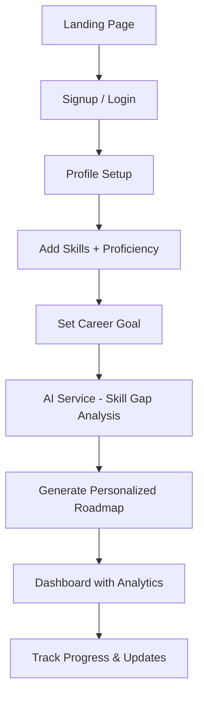
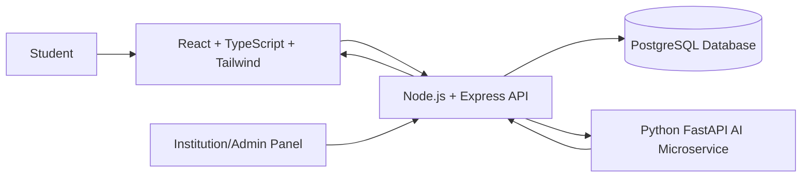
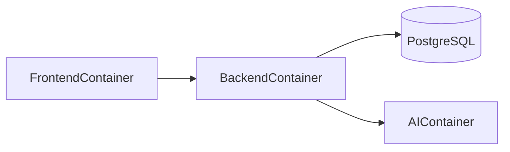
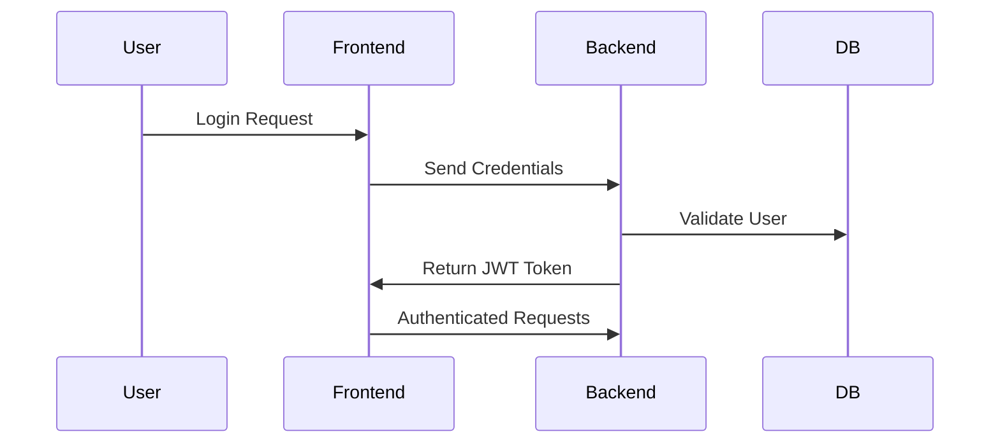

<p align="center">
  
</p>

---
## 📌 Overview


---

# ❗ Problem Statement

- Students lack clarity about their real skill levels  
- Career-required skills are often unknown  
- Learning platforms provide generic roadmaps  
- No structured personalized skill gap detection system exists  

---

# 💡 Proposed Solution

SkillMap AI provides:

- 🎯 Career-aligned recommendations  
- 📊 Competency-based skill gap detection  
- 🛣️ Custom learning roadmap generation  
- 📈 Skill coverage analytics dashboard  
- 🏫 Expandable for institutions and campuses  

---

# 🔄 System Workflow



---

# 🏗️ System Architecture



---

# 🐳 Docker Microservice Architecture



Each service runs independently and communicates via internal Docker networking.

---

# 📂 Project Structure

```
skillmap-ai/
├─ frontend/
├─ backend/
├─ ai-service/
├─ example-data/
├─ docker-compose.yml
└─ README.md
```

---

## 📁 Frontend Structure

```
frontend/
├─ public/
├─ src/
│  ├─ components/
│  ├─ pages/
│  ├─ context/
│  ├─ services/
│  ├─ App.tsx
│  └─ main.tsx
├─ tailwind.config.js
└─ package.json
```

### Responsibilities:
- Authentication UI
- Skill Management
- Career Goal Setup
- Dashboard with Radar & Bar Charts
- Roadmap Visualization

---

## 📁 Backend Structure

```
backend/src/
├─ controllers/
├─ routes/
├─ models/
├─ middleware/
├─ config/
├─ utils/
├─ app.ts
└─ server.ts
```

### Responsibilities:
- RESTful APIs
- JWT Authentication
- Business Logic
- PostgreSQL Integration
- AI Service Communication

---

## 📁 AI Service

```
ai-service/
├─ main.py
├─ utils.py
└─ requirements.txt
```

### Responsibilities:
- NLP-based Skill Analysis
- Career Requirement Mapping
- Skill Gap Identification
- Roadmap Prioritization

---

# 🛠️ Tech Stack

## Frontend
- React.js
- TypeScript
- Tailwind CSS
- Context API
- Axios

## Backend
- Node.js
- Express.js
- TypeScript
- JWT Authentication

## Database
- PostgreSQL

## AI Layer
- Python
- FastAPI
- NLP-based skill analysis logic

## DevOps
- Docker
- Docker Compose

---

# 🔐 Authentication Flow



---

# 📊 Skill Gap Analysis Logic

1. Fetch required skills for selected career goal  
2. Compare with user's existing skills  
3. Calculate proficiency gap  
4. Assign priority score  
5. Generate roadmap based on priority  

---

# 🚀 Running Locally

## 1️⃣ Using Docker (Recommended)

```bash
docker-compose up --build
```

---

## 2️⃣ Manual Setup

### Backend
```bash
cd backend
npm install
npm run dev
```

### Frontend
```bash
cd frontend
npm install
npm run dev
```

### AI Service
```bash
cd ai-service
pip install -r requirements.txt
uvicorn main:app --reload
```

---

# 📊 Example Data

Located inside `/example-data`

- users.json  
- skills.json  
- career_goals.json  

Used for demo and testing purposes.

---

# ✨ Key Features

- Personalized Skill Gap Diagnosis  
- Career Goal Aligned Recommendations  
- Custom Roadmap per Student  
- Radar & Bar Chart Analytics  
- Modular Microservice Architecture  
- Institution-ready Scalability  

---

# 🔮 Future Enhancements

- Resume Upload → Auto Skill Extraction  
- AI-based Skill Assessment Tests  
- Learning Platform Integration  
- Institution Analytics Dashboard  
- Mobile App Version  

---

# 🎯 Impact

- Clear understanding of skill gaps  
- Focused learning direction  
- Improved career readiness  
- Increased student confidence  


---

## 👩‍💻 Team SkillMap AI  
Building clarity. Enabling growth.
